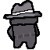
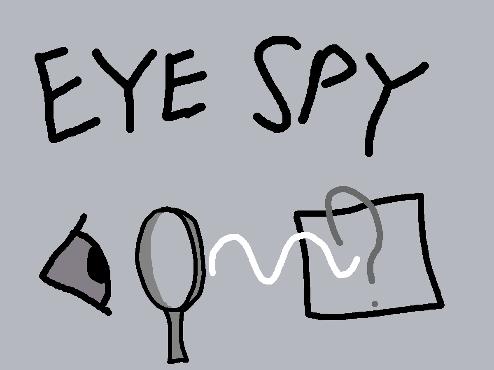

# Welcome to Eye Spy



Welcome aspiring spy, we challenge you to eye spy. A game where you must sneak through rooms of different color by matching you clothing to the color. However, you have a colour blindness so the color that appears is not the one that others will see you as. You must figure out what the wavelenght of the reflected light in each room is to disguise yourself, so when faced with your final challenge you can recognize which color blindess you have to defuse the bomb.

## Goals
1. To make a game where we can simulate simple variations of color blindness using the ROYGBIV colors.
2. Interactive learning experience on how to find the wavelength of lights in different ways

## Challenges
1. Most of the members main programming language was not Python and have never used Pygame, slowing us down by requiring us to learn the syntax and structuring
2. We had to randomly generate the color blindeness typing and adjust the appereance of rooms based on it, as well as finding the appropriate wavelength for the colors
3. We also struggled with level design unsure of how we wanted the player to solve the room color in different methods
   
## Instructions
1. Install dependencies
```
pip install -r requirements.txt
```
2. Run the main file
```
python3 main.py
```
## Images

